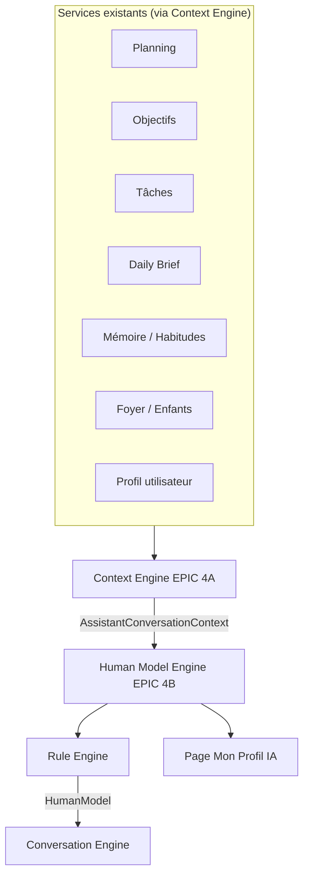

# EPIC 4B — Human Model Engine

## Objectif

Le **Human Model Engine** est le **seul composant autorisé** à interpréter l'état utilisateur :

- fatigue / énergie
- charge mentale
- stress
- motivation
- disponibilité
- équilibre global

Le **Conversation Engine** (EPIC 4A) **ne recalcule jamais** ces dimensions : il consomme uniquement le contrat `HumanModel`.

## Architecture



## Module

```
src/ai/humanModelFoundation/
├── types/
│   ├── humanModel.ts      # Contrat HumanModel + enums
│   └── ruleTypes.ts       # RuleOutput, HumanModelRuleInput
├── rules/
│   ├── fatigueRule.ts
│   ├── stressRule.ts
│   ├── mentalLoadRule.ts
│   ├── availabilityRule.ts
│   ├── focusRule.ts
│   ├── sleepRule.ts
│   ├── motivationRule.ts
│   ├── familyPressureRule.ts
│   ├── goalRule.ts
│   ├── concernRule.ts
│   └── currentStateRule.ts
├── engine/
│   └── humanModelEngine.ts
└── index.ts
```

## Contrat `HumanModel`

| Champ | Description |
|-------|-------------|
| `identity` | userId, prénom, date |
| `currentState` | Synthèse (énergie, stress, charge, disponibilité) |
| `energy` | Très reposé → Très fatigué |
| `mentalLoad` | Charge légère / normale / forte |
| `stress` | Stress faible / moyen / élevé |
| `motivation` | Faible / moyenne / bonne |
| `availability` | Faible / Moyenne / Bonne |
| `focus` | Concentration faible / moyenne / bonne |
| `sleep` | Qualité probable du sommeil (ou null) |
| `familyPressure` | Pression familiale |
| `dominantGoal` | Objectif prioritaire |
| `dominantConcern` | Préoccupation dominante |
| `confidence` | Score global 0–1 |
| `lastUpdated` | Horodatage ISO |
| `missingData` | Lacunes identifiées |

Chaque champ interprété inclut : `value`, `confidence`, `explanation`, `reasons[]`.

Les valeurs inconnues restent **`null`** — le modèle reste valide avec peu de données.

## Rule Engine

Chaque règle est **isolée**, **documentée** et **testée** :

| Règle | Entrées principales | Sortie |
|-------|---------------------|--------|
| `FatigueRule` | check-in, blocs planning, tâches | `EnergyLevel` |
| `StressRule` | check-in, densité journée | `StressLevel` |
| `MentalLoadRule` | tâches, blocs, enfants | `MentalLoadLevel` |
| `AvailabilityRule` | énergie + charge (règles locales) | `AvailabilityLevel` |
| `FocusRule` | check-in, profil focus, planning | `FocusLevel` |
| `SleepRule` | check-in, profil sommeil | `SleepQualityLevel` |
| `MotivationRule` | check-in, objectifs | `MotivationLevel` |
| `FamilyPressureRule` | enfants, membres foyer | `FamilyPressureLevel` |
| `GoalRule` | objectifs actifs | `DominantGoalSnapshot` |
| `ConcernRule` | Daily Brief, tâches, gaps | `string` |
| `CurrentStateRule` | agrège énergie, stress, charge, dispo | `CurrentStateSummary` |

### Exemple — FatigueRule

```
Entrée : mood=tired, fatigue_level=high, 8 blocs, 10 tâches
Calcul : score cumulatif → mapping EnergyLevel
Sortie : « Fatigué » ou « Très fatigué »
Explication : liste des signaux (check-in, planning, tâches)
Confiance : 0.35 + 0.15 × nombre de signaux (max 0.95)
```

## Explainability

Chaque champ produit :

1. **Pourquoi ?** — phrase `explanation`
2. **Justifications** — liste `reasons` (puces)
3. **Confiance** — score par champ + global

La page **Mon Profil IA** expose un bouton **« Pourquoi ? »** ouvrant le détail.

## Intégration Conversation Engine

Flux `processMessage` :

1. `buildAssistantContext()` — agrégation services
2. `buildHumanModel(context)` — interprétation
3. `classifyIntent()` — routage intention
4. `buildAssistantPrompt({ context, humanModel, … })` — prompt avec bloc Human Model
5. `buildReadOnlyAssistantResponse({ context, humanModel, … })` — réponse basée sur Human Model

Le prompt système interdit explicitement de recalculer fatigue / motivation / charge.

## UI — Mon Profil IA

- Route : `/ai-profile`
- Feature flag : `VITE_HUMAN_MODEL=true` (défaut : **false**)
- Navigation : Organisation → **Mon Profil IA**
- Hook : `useHumanModel`

Sections affichées :

- Mon état actuel, énergie, charge mentale, motivation, disponibilité…
- Ce que l'IA connaît / ce qui lui manque
- Confiance + bouton « Pourquoi ? »

## Tests

| Fichier | Couverture |
|---------|------------|
| `rules/rules.test.ts` | Règles individuelles |
| `engine/humanModelEngine.test.ts` | Agrégation HumanModel |
| `conversation/humanModelIntegration.test.ts` | Fatigue / motivation via HumanModel |
| `conversation/conversationEngine.test.ts` | humanModel dans output |

## Évolutions futures

- Ingestion `BehaviorSignal` (contrat `IHumanModelEngine` existant)
- Corrections utilisateur (`applyCorrection`)
- Persistance snapshot Supabase
- Règles enrichies (habitudes, tendances living memory)
- Brancher un LLM sur le bloc `humanModelBlock` du prompt

## Invariants

1. **Aucun appel Supabase direct** dans Human Model — uniquement via Context Engine / services.
2. **Pas de duplication** de logique planning / objectifs / brief.
3. **Règles explicites** — pas de modèle opaque.
4. **Conversation Engine** = consommateur, jamais interprèteur.
