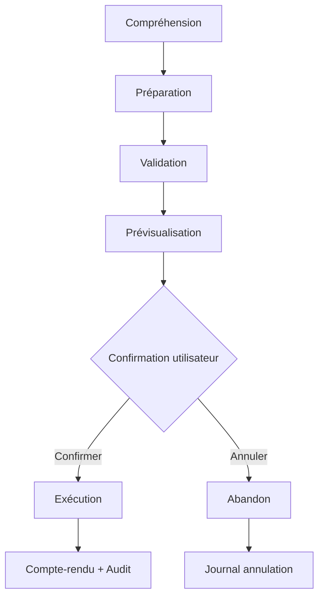
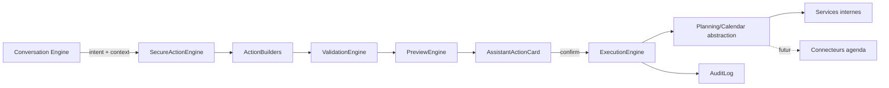

# EPIC 4C — Secure Action Engine

## Objectif

Transformer l'assistant en **assistant personnel proactif** : il peut **proposer des actions réelles**, mais **ne modifie jamais les données sans confirmation explicite**.

Principe fondamental :

> L'assistant propose. L'utilisateur décide.

## Cycle de vie obligatoire



Aucune exception : **aucune écriture directe** depuis le Conversation Engine.

## Architecture



### Garde Planning / Agenda (EPIC 4C)

L'Action Engine **ne doit jamais** appeler Google Calendar ou un connecteur externe directement.

```
Conversation Engine → Secure Action Engine → Planning/Calendar abstraction → Services
```

Contrat : `src/ai/actionEngine/planning/planningCalendarContract.ts`

- `CalendarScope` : `internal` | `external` | `synchronized`
- `IPlanningCalendarGateway` — interface future (non branchée)
- Opérations : `createEvent`, `updateEvent`, `rescheduleEvent`, `deleteEvent`, `reorganizeDay`, `createReminder`
- Métadonnées `SecureAction` : `calendarScope`, `planningTarget`, `executionAvailable`
- Hint preview synchronisé : « Cette modification affectera Équilibre IA et votre agenda. »

EPIC 4C : pas de OAuth, pas de connecteur Google — **contrats et frontières uniquement**.

### Modules

| Module | Chemin | Rôle |
|--------|--------|------|
| Contrat | `src/ai/actionEngine/types/secureAction.ts` | `SecureAction`, statuts, preview, validation |
| Builders | `src/ai/actionEngine/builders/actionBuilders.ts` | Analyse, préparation, preview — **sans écriture** |
| Validation | `src/ai/actionEngine/validation/validationEngine.ts` | Données, permissions, cohérence |
| Preview | `src/ai/actionEngine/preview/previewEngine.ts` | Avant / Après / Impact / Confiance |
| Orchestrateur | `src/ai/actionEngine/engine/actionEngine.ts` | prepare / confirm / cancel |
| Exécution | `src/ai/actionEngine/execution/executionEngine.ts` | Orchestration services — **sans logique métier** |
| Audit | `src/ai/actionEngine/audit/auditLog.ts` | Qui, quand, pourquoi, résultat, durée |
| Undo | `src/ai/actionEngine/undo/undoContract.ts` | Contrat préparé — **non implémenté** |
| Planning | `src/ai/actionEngine/planning/planningCalendarContract.ts` | Abstraction agenda — **contrat seulement** |
| Bridge | `src/ai/actionEngine/bridge/assistantActionBridge.ts` | Conversation ↔ ActionEngine |
| UI | `src/components/assistant/AssistantActionCard.tsx` | Confirmer / Annuler |

## Contrat `SecureAction`

Chaque action contient :

- `id`, `type`, `description`, `summary`, `target`, `payload`
- `riskLevel`, `requiresConfirmation`, `estimatedImpact`
- `createdAt`, `expiresAt`, `status`
- `sourceIntent`, `origin`
- `preview`, `validation`, `explainability`
- `calendarScope`, `planningTarget`, `executionAvailable`

Statuts : `pending_confirmation` → `executing` → `confirmed` → `executed` | `failed` | `cancelled` | `expired`

TTL par défaut : **15 minutes** (`DEFAULT_ACTION_TTL_MS`).

## Types d'actions (extensible)

| Type | Builder | Preview | Validation | Exécution EPIC 4C | Portée calendrier |
|------|---------|---------|------------|-------------------|-------------------|
| `createTask` | CreateTaskBuilder | ✅ | ✅ | ✅ `tasksService.createTask` | — |
| `createReminder` | CreateReminderBuilder | ✅ | ✅ | ✅ (tâche catégorie reminder) | `internal` |
| `modifyTask` | ModifyTaskBuilder | ✅ | ✅ | ✅ `updateTaskStatus` | — |
| `deleteTask` | DeleteTaskBuilder | ✅ | ✅ | ✅ soft delete (`cancelled`) | — |
| `moveTask` | MoveTaskBuilder | ✅ | ✅ | ✅ `rescheduleNonUrgentTasks` | `internal` |
| `updateGoal` | GoalBuilder | ✅ | ✅ | ✅ `updateUserGoal` | — |
| `reorganizeDay` | PlanningBuilder | ✅ | ✅ | ✅ `rescheduleNonUrgentTasks` | `internal` |
| `rescheduleEvent` | RescheduleBuilder | ✅ | ✅ | ❌ `not_implemented` | `synchronized` |
| `notifyHousehold` | NotifyHouseholdBuilder | ✅ | ✅ | ❌ `not_implemented` | — |

Tous implémentent l'interface `ActionBuilder`.  
Ne pas présenter `rescheduleEvent` / `notifyHousehold` comme pleinement disponibles : `executionAvailable: false` + UI explicite.

## Validation

Exemples de contrôles :

- Titre / tâche / objectif / événement manquant
- Tâche ou objectif supprimé
- Feature flag objectifs ou collaboration désactivée
- Confirmation absente
- Action expirée
- `userId` incohérent (permission refusée)
- **Validation finale avant écriture** (`validateActionBeforeExecution`) — données fraîches obligatoires

Erreurs explicites via `ValidationIssue` + `formatValidationErrors()`.

## Idempotence confirmation

- Verrou in-memory `confirmingKeys` par `userId:actionId`
- Statut `executing` pendant le traitement
- Second appel concurrent → rejet « Confirmation déjà en cours »

## Prévisualisation

L'utilisateur voit dans `AssistantActionCard` :

- **Titre** et **résumé**
- **Avant / Après**
- **Impact estimé**
- **Risque** (low / medium / high)
- **Pourquoi** (explainability)
- Boutons **Confirmer** / **Annuler**

Aucune exécution tant que `validation.valid === false` ou confirmation absente.

## Confirmation UI

Composant : `AssistantActionCard`

- Au **Confirmer** → `SecureActionEngine.confirmAction()` → ExecutionEngine → message « Action réalisée. »
- Au **Annuler** → `cancelAction()` → message « Action abandonnée. »

## Sécurité

Exécution **interdite** si :

1. `requiresConfirmation !== true`
2. Validation échouée
3. Statut ≠ `pending_confirmation` / `confirmed`
4. Action expirée
5. Permission insuffisante (`userId` mismatch, flags désactivés)

Le Conversation Engine **n'appelle jamais** les services métier directement.

## Audit

Journal local (`localStorage`) par utilisateur :

- actionId, userId, actionType, origin, sourceIntent
- status : `prepared` | `confirmed` | `cancelled` | `executed` | `failed` | `expired`
- startedAt, finishedAt, durationMs
- resultSummary, error éventuelle

Limite : 50 entrées conservées. Pas de payload sensible complet.

## Undo (architecture)

Contrat `UndoToken` / `IUndoEngine` préparé dans `undo/undoContract.ts`.

Message : `UNDO_NOT_IMPLEMENTED_MESSAGE` — exécution reportée.

## Feature flag

```env
VITE_SECURE_ACTION_ENGINE=false   # défaut production
VITE_ASSISTANT_IA=true            # requis pour l'UI /assistant
```

**Guardian** : le flag reste `false` dans `.env.guardian` pour éviter les régressions visuelles.

Tests EPIC 4C : `playwright.epic4c.config.ts` active `VITE_SECURE_ACTION_ENGINE=true`.

## Tests

| Suite | Commande | Résultat certification |
|-------|----------|--------------------------|
| Unitaires Action Engine | `npm run test:action-engine` | ✅ 33/33 |
| E2E EPIC 4C | `npm run test:e2e:epic4c` | ✅ 7/7 (+ setup) |
| Guardian | `npm run quality-guardian` | ✅ 15/15 |

Rapport complet : `Docs/EPIC4C_CERTIFICATION_REPORT.md`

Scénarios E2E :

- Créer une tâche via l'assistant (preview, pas d'écriture avant confirmation)
- Confirmer → écriture réelle + audit
- Annuler sans écriture
- Déplacer une tâche (proposition planning)
- Payload invalide (`rescheduleEvent` sans entryId)
- Permission refusée (`notifyHousehold` sans collaboration)
- Anti-double-clic sur Confirmer

Scénarios unitaires additionnels :

- Expiration, tâche supprimée, permission retirée (`expirationObsolescence.test.ts`)
- Audit 6 statuts (`auditLog.test.ts`)
- Planning/Calendar contract (`planningCalendarContract.test.ts`)

## Intégration Conversation

1. `processMessage()` → `buildReadOnlyAssistantResponse()` (EPIC 4A)
2. Si flag actif → `SecureActionEngine.prepareActions()`
3. `mergeSecureActionsIntoResponse()` → `proposedActions` exécutables
4. UI rend `AssistantActionCard`
5. `confirmAction()` / `cancelAction()` sur `AssistantConversationEngine`

## Fichiers impactés

- `src/ai/actionEngine/**` (nouveau module)
- `src/ai/conversationFoundation/**` (intégration)
- `src/components/assistant/**` (UI)
- `src/hooks/useAssistantConversation.ts`
- `src/config/featureFlags.ts`
- `src/styles/sprint4c-action-engine.css`
