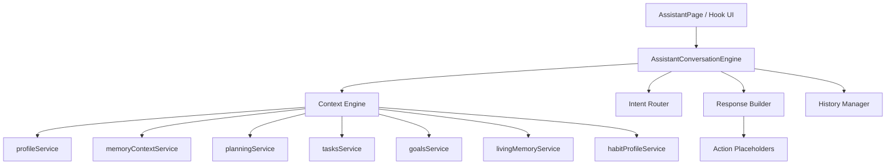

# EPIC 4A — Conversation Engine Foundation

> **Sprint :** 4A — Fondations assistant conversationnel  
> **Mode :** Lecture seule (conseil, explication — aucune mutation)  
> **Statut :** Implémenté — en attente de validation

---

## 1. Vision

Équilibre IA n'est **pas** un clone de ChatGPT. L'assistant est un **cerveau personnel** qui connaît l'utilisateur via les moteurs existants (planning, tâches, objectifs, foyer, Daily Brief, mémoire).

Le **Conversation Engine** est :

- orchestrateur de tour de dialogue
- gestionnaire de contexte et d'historique
- routeur d'intentions
- coordinateur d'actions **proposées** (pas exécutées en 4A)

Il **n'est pas** responsable des décisions métier — celles-ci restent dans les moteurs EPIC existants.

---

## 2. Architecture



### Couches

| Couche | Dossier | Responsabilité |
|--------|---------|----------------|
| Types | `src/ai/conversationFoundation/types/` | Contrats contexte, réponse, historique, actions |
| Context Engine | `context/` | Agrégation read-only via services |
| Intent Router | `intent/` | Classification extensible (registre) |
| Conversation Engine | `conversation/` | Orchestration tour, prompt, historique |
| Explainability | `explainability/` | Sources et justification |
| UI | `src/pages/AssistantPage.tsx` | Page conversation simple |
| Hook | `src/hooks/useAssistantConversation.ts` | Pont React ↔ moteur |

---

## 3. Context Engine

**Entrée :** `userId`, `date`, `firstName`  
**Sortie :** `AssistantConversationContext`

Données agrégées :

- utilisateur et profil
- foyer, membres, enfants
- planning du jour (contexte + blocs)
- tâches (totaux + titres)
- objectifs actifs (si flag)
- Daily Brief (via `buildDailyBrief` + données services)
- mémoire vivante et habitudes
- faits profil connus

**Règle :** aucun appel Supabase direct — uniquement `ContextEngineDependencies` (services existants).

**Lacunes :** tableau `gaps[]` explicite quand une donnée manque.

---

## 4. Intent Router

Registre de règles `{ intent, keywords, weight }` — extensible via `register()` sans chaînes if/else.

Intentions supportées :

`planning`, `goals`, `organization`, `fatigue`, `motivation`, `family`, `household`, `work`, `studies`, `finances`, `daily_brief`, `free_conversation`

---

## 5. Response Contract

Type `AssistantResponse` :

| Champ | Description |
|-------|-------------|
| `text` | Réponse utilisateur |
| `confidence` | Confiance classification |
| `intent` | Intention détectée |
| `reasoning` | Raisonnement court |
| `suggestions` | Pistes UI |
| `proposedActions` | Actions futures (`not_implemented`) |
| `warning` | Alerte si données manquantes |
| `explanation` | Explainable AI (sources, missingData) |
| `readOnly` | Toujours `true` en 4A |

---

## 6. Action Engine (placeholder)

Interfaces : `createTask`, `moveTask`, `updateGoal`, `reschedule`, `notifyHousehold`, etc.

Toutes retournent `{ status: "not_implemented" }` — préparation EPIC 4B.

---

## 7. Historique

Architecture `ConversationStoreState` :

- **active** — conversation courante (localStorage)
- **archives** — structure prête, UI future
- **summary** — résumé compact des derniers messages

Fonctions : `loadConversationStore`, `saveConversationStore`, `archiveActiveConversation` (foundation).

---

## 8. UI — Page Assistant IA

Route : `/assistant`  
Flag : `VITE_ASSISTANT_IA=true`

Composants :

- `AssistantMessageList` — historique scrollable
- `AssistantComposer` — saisie + envoyer
- `AssistantMessageBubble` — bulle + meta explainable

---

## 9. Sécurité

- Pas d'invention de tâches, événements ou objectifs
- Réponses conditionnées aux données réellement chargées
- Warnings explicites si contexte incomplet

---

## 10. Évolutions prévues (EPIC 4B+)

1. Branchement LLM sur `buildAssistantPrompt`
2. Action Engine exécutable (avec confirmation)
3. Archives UI + résumé long terme
4. Adapter legacy `conversationEngine.ts` → contrat `IConversationEngine`
5. Voix / barre header unifiée

---

## 11. Activation locale

```env
VITE_ASSISTANT_IA=true
```

Puis ouvrir `/assistant` ou le menu « Assistant IA ».

---

## 12. Tests

- `contextEngine.test.ts`
- `intentRouter.test.ts`
- `responseBuilder.test.ts`
- `conversationEngine.test.ts`
- `actionPlaceholders.test.ts`

```bash
npm test
npm run lint
npm run build
```
