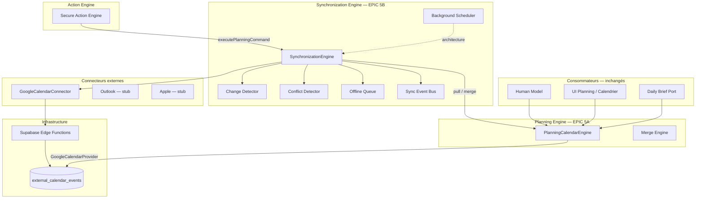

# EPIC 5B — Intelligent Calendar Synchronization

## Vision

Synchronisation bidirectionnelle entre le **planning interne** et les agendas externes (Google en premier, Outlook et Apple en roadmap), **sans modifier le Planning Engine**.

Le **PlanningCalendarEngine** reste la **seule source** consommée par le reste de l'application (Human Model, Daily Brief, UI planning, etc.).

Toute la logique Google est confinée dans `calendarSyncEngine/`.

## Architecture



## Flag d'activation

| Variable | Default | Rôle |
|----------|---------|------|
| `VITE_GOOGLE_CALENDAR_ENABLED` | `false` | OAuth + edge functions Google |
| `VITE_PLANNING_CALENDAR_ENGINE` | `false` | Planning Engine unifié |
| `VITE_CALENDAR_SYNC_ENGINE` | `false` | Synchronization Engine (EPIC 5B) |

Les trois flags doivent être activés pour la sync complète.

## OAuth 2

### Flux

1. UI **Paramètres → Calendriers** (`/settings/calendars`)
2. `GoogleCalendarConnector.connect()` → edge function `google-calendar-auth`
3. Callback `google-calendar-callback` → tokens stockés dans `google_calendar_connections`
4. Sync pull via `google-calendar-sync`

### États OAuth

| État | Description |
|------|-------------|
| `disconnected` | Aucune connexion |
| `connected` | Token valide, compte lié |
| `expired` | Sync trop ancienne / token à renouveler |
| `revoked` | Accès révoqué côté Google |
| `error` | Erreur de connexion |

### Sécurité

- Tokens **jamais** exposés au client — edge functions uniquement
- Scope actuel : `calendar.readonly` (lecture)
- Écriture (`createEvent`, `updateEvent`, `deleteEvent`) : architecture prête, scope `calendar.events` requis (EPIC futur)

## GoogleCalendarConnector

Implémente le contrat `CalendarConnector` (EPIC 5A) :

| Méthode | Implémentation |
|---------|----------------|
| `connect()` | OAuth via edge function |
| `disconnect()` | Edge function + purge connexion |
| `fetchEvents()` | Lecture `external_calendar_events` |
| `createEvent()` | `invokeMutate` ou file offline |
| `updateEvent()` | idem |
| `deleteEvent()` | idem |
| `watch()` | Architecture préparée, non activée |
| `pullSync()` | Edge function sync |

**Aucun appel direct à l'API Google depuis le client.**

## Synchronization Engine

| Fonction | Rôle |
|----------|------|
| `pull()` | Sync distante → DB → providers → timeline |
| `push()` | Vide la file offline vers le connecteur |
| `merge()` | Fusion via Merge Engine (5A) |
| `detectChanges()` | Diff avant/après snapshot |
| `detectConflicts()` | Conflits sans auto-résolution |
| `resolveConflicts()` | Produit `ConflictResolution` + preview |
| `queue()` | Enfile opérations offline |
| `retry()` | Rejoue les opérations `failed` |

### États de sync

`pending` · `syncing` · `synced` · `conflict` · `failed` · `external_deleted` · `local_deleted`

## Gestion des conflits

Types détectés :

- `both_moved` — déplacé des deux côtés
- `external_deleted` / `local_deleted`
- `time_mismatch` — horaire différent
- `title_mismatch`
- `participants_mismatch`

Chaque conflit produit un `ConflictResolution` avec :

- **Avant / Après**
- **Source / Destination**
- **Différences**
- **Impact**
- Options : `keep_local` · `keep_external` · `merge_manual` · `skip`

**Jamais d'application automatique** — l'utilisateur décide via l'UI.

## Offline

- File locale (`localStorage`) : `OfflineSyncQueue`
- Opérations `pending` / `failed` rejouées au `push()` ou `retry()`
- Erreurs réseau → `markFailed` + compteur `attempts`

## Background sync

`BackgroundSyncScheduler` — architecture uniquement :

- Intervalle configurable (default 15 min)
- **Désactivé par défaut** (`enabled: false`)
- Activation future via feature flag ou paramètre utilisateur

## Événements internes

| Événement | Payload |
|-----------|---------|
| `SyncStarted` | provider, direction |
| `SyncCompleted` | success, itemCount, message |
| `ConflictDetected` | resolutions[] |

Bus : `SyncEventBus` (pub/sub + historique).

## Action Engine

Quand `VITE_CALENDAR_SYNC_ENGINE=true` :

```
Action Engine → SynchronizationEngine.executePlanningCommand()
              → PlanningCalendarEngine (interne)
              → queue push (scope external/synchronized)
```

Jamais : `Action Engine → Google Calendar`.

## Human Model

**Aucune modification.** Continue d'utiliser uniquement `PlanningCalendarEngine`.

## UI

**Paramètres → Calendriers** (`/settings/calendars`)

Affiche :

- Google connecté / compte
- Dernière synchronisation
- Nombre d'événements (jour courant)
- État lifecycle
- Boutons Synchroniser / Déconnecter
- Historique (10 dernières entrées)
- Panneau conflits (preview)

Lien depuis **Mon profil** quand le sync engine est activé.

## Roadmap Outlook

1. `OutlookCalendarConnector` implémentant `CalendarConnector`
2. OAuth Microsoft Graph (`Calendars.ReadWrite`)
3. Table `external_calendar_events` — champ `provider: 'outlook'`
4. Provider `outlook` dans `createDefaultProviders()`
5. Résolution conflits multi-provider

## Roadmap Apple

1. CalDAV + Apple Sign In ou app-specific password
2. `AppleCalendarConnector` stub → implémentation
3. Sync via serveur (pas de CalDAV direct browser)
4. Provider `apple-calendar` activé dans Planning Engine deps

## Tests

```bash
npm run test:calendar-sync-engine
```

Scénarios couverts :

| Scénario | Fichier |
|----------|---------|
| OAuth session | `oauth/oauthSession.test.ts` |
| Connecteur Google | `connectors/googleCalendarConnector.test.ts` |
| Sync engine pull/push/retry | `sync/synchronizationEngine.test.ts` |
| Conflits | `sync/conflictDetector.test.ts` |
| Suppressions | `sync/changeDetector.test.ts` |
| Offline queue | `sync/offlineQueue.test.ts` |
| Event bus | `events/syncEventBus.test.ts` |
| Background scheduler | `sync/backgroundSyncScheduler.test.ts` |

## Structure des fichiers

```
src/calendarSyncEngine/
├── connectors/googleCalendarConnector.ts
├── providers/googleCalendarProvider.ts
├── sync/
│   ├── synchronizationEngine.ts
│   ├── changeDetector.ts
│   ├── conflictDetector.ts
│   ├── offlineQueue.ts
│   ├── syncHistory.ts
│   └── backgroundSyncScheduler.ts
├── oauth/oauthSession.ts
├── events/syncEventBus.ts
├── mappers/externalEventMapper.ts
├── types/syncTypes.ts
└── index.ts
```

## Limites connues (5B)

1. Scope Google **readonly** — push réel nécessite migration scope + edge function `google-calendar-mutate`
2. `watch()` (push notifications Google) — non activé
3. Background sync — architecture seulement
4. Résolution conflits — preview UI, pas encore d'application du choix utilisateur
5. Outlook / Apple — stubs conservés dans Planning Engine deps

## Références

- [EPIC 5A — Planning Engine](./EPIC5_PLANNING_ENGINE.md)
- Migration DB : `supabase/migrations/00008_google_calendar.sql`
- Edge functions : `supabase/functions/google-calendar-*`
