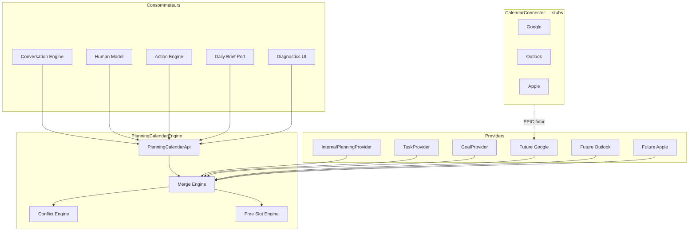

# EPIC 5A — Planning & Calendar Engine Foundation

## Vision

Une **vision unique du temps** : planning, agenda, tâches planifiées, objectifs planifiés et rendez-vous convergent vers un même contrat `CalendarItem` et une **timeline fusionnée**.

Le **PlanningCalendarEngine** est la seule porte d'entrée pour toute information temporelle consommée par :

- Conversation Engine
- Human Model
- Action Engine
- Daily Brief (port préparé)
- UI diagnostic (développement)
- Futurs connecteurs (Google, Outlook, Apple)

## Architecture



Aucun consommateur n'accède directement aux connecteurs externes.

## Contrat CalendarItem

Fichier : `src/planningCalendarEngine/types/calendarItem.ts`

Champs principaux :

| Champ | Rôle |
|-------|------|
| `id`, `type`, `title`, `description` | Identité unifiée |
| `start`, `end`, `timezone`, `allDay` | Temporalité |
| `owner`, `household`, `participants` | Acteurs |
| `status`, `priority` | État métier |
| `origin`, `source`, `syncState` | Provenance |
| `editable`, `recurrence`, `metadata` | Extensibilité |

### Types d'élément

`event` | `task` | `appointment` | `goal` | `reminder` | `constraint` | `free` | `other`

### Sync states (préparés)

`local` | `synced` | `pending` | `conflict` | `external` | `error`

## Providers

Interface : `ICalendarProvider` (`fetchItems`)

| Provider | ID | Source réelle EPIC 5A |
|----------|-----|------------------------|
| InternalPlanningProvider | `internal-planning` | `planningService.loadCalendarItemsForDate` |
| TaskProvider | `tasks` | `tasksService.getUserTasks` (due_at) |
| GoalProvider | `goals` | `goalsService.getUserGoals` (targetDate) |
| FutureGoogleCalendarProvider | `google-calendar` | Stub — not implemented |
| FutureOutlookProvider | `outlook` | Stub |
| FutureAppleProvider | `apple-calendar` | Stub |

## Merge Engine

`mergeCalendarItems()` :

- fusionne tous les items providers
- dédoublonne par `id`
- trie par `start`
- **ne discrimine pas** les providers dans la logique de fusion (timeline provider-agnostique)

## Conflict Engine

`detectCalendarConflicts()` détecte :

- chevauchements (`overlap`)
- doublons (`duplicate`)
- créneaux impossibles (`impossible_slot`)
- objectif pendant rendez-vous (`goal_during_appointment`)
- sync incompatible (`sync_incompatible`)

## Free Slot Engine

`findFreeSlots()` :

- créneaux libres dans une plage
- durée minimale configurable
- utilisé par Human Model (via métriques) et diagnostics

## Planning API

Classe : `PlanningCalendarApi` (`src/planningCalendarEngine/api/planningCalendarApi.ts`)

| Méthode | Description |
|---------|-------------|
| `getTimeline()` | Timeline fusionnée |
| `getEvents()` | Liste d'items |
| `getToday()` | Snapshot journée |
| `getWeek()` | Snapshot semaine |
| `findFreeSlots()` | Créneaux libres |
| `detectConflicts()` | Conflits |
| `getSources()` | Métadonnées providers |
| `buildSnapshot()` | Snapshot complet |

## CalendarConnector (stubs)

Fichier : `contract/calendarConnector.ts`

Méthodes : `connect`, `disconnect`, `fetchEvents`, `pushChanges`, `deleteEvent`, `updateEvent`, `watch`

Toutes retournent : **Not implemented** (`CALENDAR_CONNECTOR_NOT_IMPLEMENTED`)

## Intégrations EPIC 5A

### Action Engine

Si `VITE_PLANNING_CALENDAR_ENGINE=true` :

- `moveTask` / `reorganizeDay` → `PlanningCalendarEngine.reorganizeDay()`
- `rescheduleEvent` → `executePlanningCommand()` → `not_implemented`

Sinon : comportement EPIC 4C inchangé (services directs).

### Human Model

Si flag actif, Context Engine enrichit `planningCalendar` :

- `eventCount`, `conflictCount`, `freeMinutes`, `busyMinutes`

`availabilityRule` consomme `freeMinutesToday` et `conflictCount`.

### Daily Brief

Port : `IDailyBriefPlanningPort` + `createDailyBriefPlanningPort()`

Migration complète reportée — interface prête.

## Feature flag

```env
VITE_PLANNING_CALENDAR_ENGINE=false   # défaut
```

Fonction : `isPlanningCalendarEngineEnabled()`

Guardian : **reste à false** (aucune régression visuelle).

## Page diagnostic (DEV)

Route : `/planning-engine`  
Visible si : `import.meta.env.DEV && VITE_PLANNING_CALENDAR_ENGINE=true`

Affiche : événements, providers, timeline, conflits, créneaux libres, état sync.

## Tests

```bash
npm run test:planning-calendar-engine   # 22 tests
npm test                                # suite complète
```

Jeux de données : `src/planningCalendarEngine/testing/fixtures.ts`

- agenda vide / simple / chargé
- chevauchements
- multi-providers
- récurrents

## Roadmap Google Calendar (EPIC futurs)

1. Implémenter `CalendarConnector` Google (OAuth hors EPIC 5A)
2. Brancher `FutureGoogleCalendarProvider` sur le connector
3. Sync bidirectionnelle + résolution conflits `sync_incompatible`
4. Scope `synchronized` dans Action Engine previews
5. Suggestions IA et réorganisation auto via Free Slot Engine

**Aucune modification** requise dans Conversation Engine, Human Model ou Action Engine une fois le flag et les providers branchés.

## Fichiers clés

```
src/planningCalendarEngine/
├── types/calendarItem.ts
├── providers/
├── merge/mergeEngine.ts
├── conflict/conflictEngine.ts
├── freeSlot/freeSlotEngine.ts
├── engine/planningCalendarEngine.ts
├── api/planningCalendarApi.ts
├── contract/calendarConnector.ts
└── diagnostics/buildPlanningDiagnostics.ts
```
