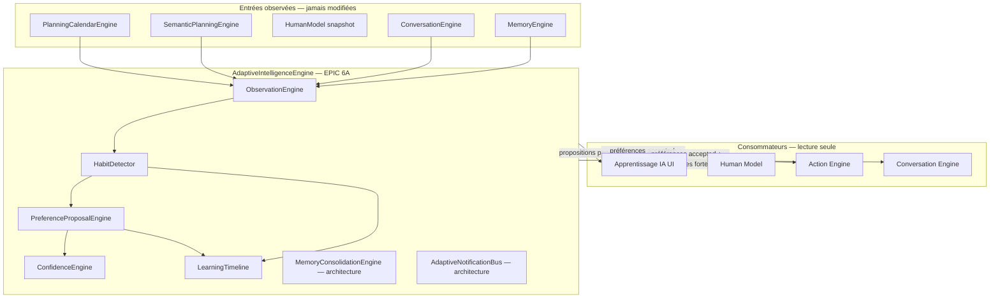
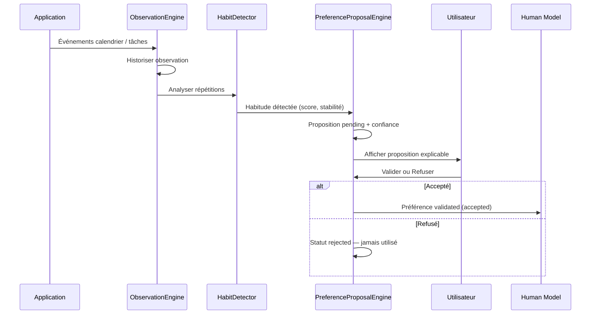

# EPIC 6A — Adaptive Intelligence Engine

## Vision

Créer le **moteur d'apprentissage progressif** d'Équilibre IA : observer, détecter des habitudes, calculer une confiance, **proposer** une préférence, attendre la **validation utilisateur**.

**Principe fondamental : l'IA ne modifie jamais directement le comportement de l'application.**

Aucune adaptation silencieuse. Toutes les décisions restent explicables.

## Architecture



## Cycle d'apprentissage



## Flag d'activation

| Variable | Default | Prérequis |
|----------|---------|-----------|
| `VITE_ADAPTIVE_INTELLIGENCE` | `false` | `VITE_PLANNING_CALENDAR_ENGINE=true` |

Recommandé avec `VITE_SEMANTIC_PLANNING_ENGINE=true` pour des observations enrichies (catégories).

## Composants

| Composant | Rôle |
|-----------|------|
| `ObservationEngine` | Observe créations, reports, annulations, répétitions |
| `HabitDetector` | Détecte sport, sommeil, travail, études, méditation… |
| `PreferenceProposalEngine` | Transforme habitudes en propositions **pending** |
| `ConfidenceEngine` | Calcule confiance explicable (jamais arbitraire) |
| `LearningTimeline` | Traçabilité complète (détection, proposition, validation) |
| `MemoryConsolidationEngine` | Fusion, nettoyage, archivage — **architecture only** |
| `AdaptiveNotificationBus` | Queue notifications — **jamais envoyées auto** |

## États de validation

| État | Description |
|------|-------------|
| `pending` | Proposition en attente — **n'influence rien** |
| `accepted` | Validée par l'utilisateur — consommée par Human Model / Action |
| `rejected` | Refusée — **jamais réutilisée** |
| `expired` | Expirée (consolidation future) |
| `obsolete` | Habitude disparue |

## Calcul de confiance

```
confidence = ratio(match/total)*0.45 + frequencyBoost + stabilityBoost + avgObsConf*0.2
```

Chaque préférence expose :

- **Pourquoi** — raison métier
- **Quelles observations** — labels des données sources
- **Combien** — `observationCount`
- **Depuis quand** — `periodDays`
- **Confiance** — `confidenceLevel` (0–1)
- **Historique** — Learning Timeline

## Validation utilisateur

- Boutons **Valider** / **Refuser** sur l'UI Organisation → Apprentissage IA
- `acceptPreference()` / `rejectPreference()` — localStorage par utilisateur
- Human Model consomme **uniquement** `validatedPreferences`
- Action Engine utilise validated + habitudes fortes — **jamais rejected**

## Conversation Engine

Formulations autorisées :

- « J'ai remarqué… »
- « Je pense avoir identifié… »
- « Souhaites-tu que je retienne cette préférence ? »

Formulations **interdites** :

- « J'ai changé… »
- « J'ai modifié… »
- « C'est fait »

## Consolidation mémoire (architecture)

`MemoryConsolidationEngine` — exécution périodique future :

- Fusion d'observations similaires
- Suppression des observations faibles
- Baisse progressive des confiances
- Archivage des habitudes obsolètes

## UI

**Organisation → Apprentissage IA** — `/organization/adaptive-learning`

Sections :

- Observations
- Habitudes détectées
- Préférences proposées (pending)
- Préférences validées
- Confiance / explainability
- Historique (timeline)
- Filtres + recherche
- Validation / Refus

## Notifications (architecture)

Prévu pour :

- Nouvelle habitude détectée
- Préférence proposée
- Habitude devenue obsolète

`AdaptiveNotificationBus.queue()` — **aucun envoi automatique** en EPIC 6A.

## Roadmap IA adaptative

| Phase | Contenu |
|-------|---------|
| **6A (actuel)** | Observation, habitudes, propositions, validation, timeline |
| **6B** | Consolidation mémoire active, expiration automatique |
| **6C** | Notifications utilisateur opt-in |
| **6D** | Modèles ML pour détection de patterns complexes |
| **6E** | Synchronisation préférences validées avec profil cloud |

## Tests

```bash
npm run test:adaptive-intelligence-engine
```

Jeux de données :

- Utilisateur régulier
- Utilisateur irrégulier
- Nouvelle habitude
- Ancienne habitude
- Habitude abandonnée
- Préférence refusée
- Préférence validée

## Module

```
src/adaptiveIntelligenceEngine/
├── types/adaptiveTypes.ts
├── observation/
├── habit/
├── preference/
├── confidence/
├── timeline/
├── consolidation/
├── events/
├── phrasing/
├── action/
├── engine/
├── diagnostics/
└── testing/
```
