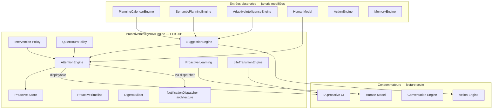
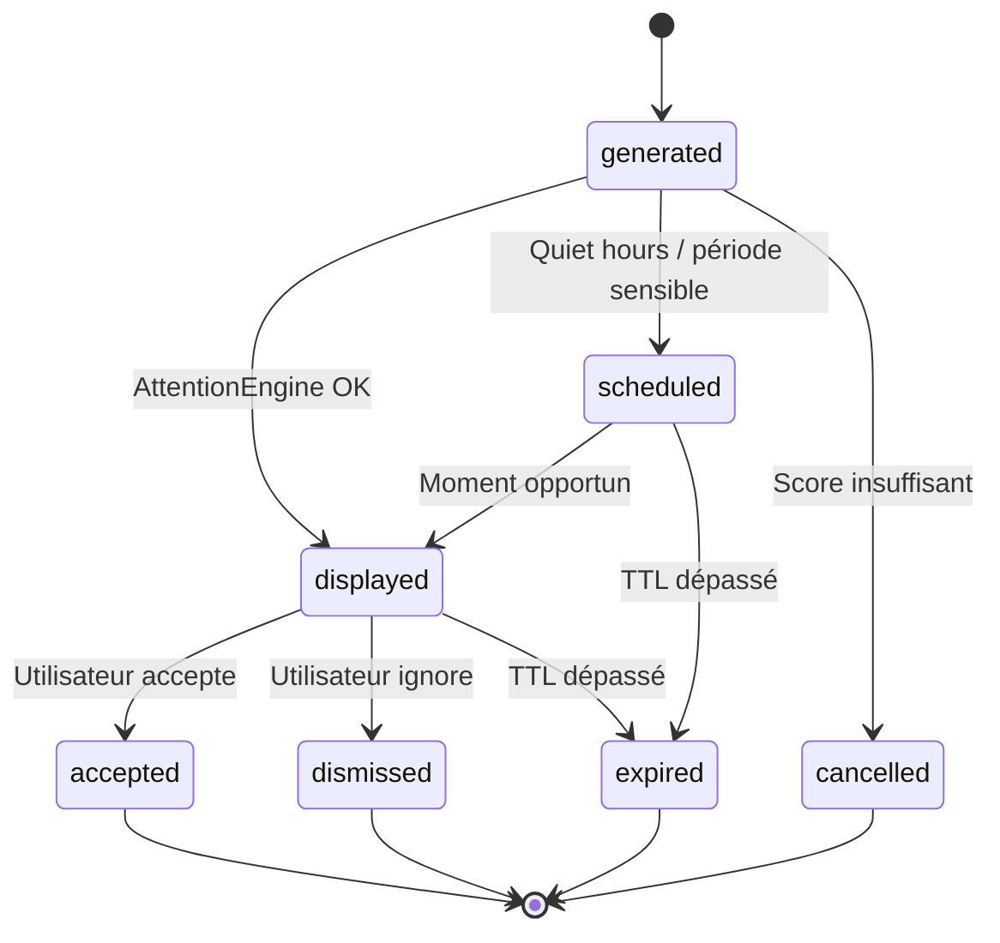

# EPIC 6B — Proactive Intelligence Engine

## Vision

Créer le **moteur de proactivité** d'Équilibre IA : savoir **quand intervenir**, **quand attendre**, **quand ne rien dire**.

**Principe fondamental : le moteur ne prend jamais d'action seul. Il propose. L'utilisateur décide.**

Aucune notification sans passage par `AttentionEngine`.

## Architecture



## Cycle des suggestions



## Flag d'activation

| Variable | Default | Prérequis |
|----------|---------|-----------|
| `VITE_PROACTIVE_INTELLIGENCE` | `false` | `VITE_PLANNING_CALENDAR_ENGINE=true` |

Recommandé avec `VITE_SEMANTIC_PLANNING_ENGINE` et `VITE_ADAPTIVE_INTELLIGENCE`.

## Attention Engine

Responsabilités :

- Déterminer si une intervention est utile
- Calculer le meilleur moment
- Éviter les interruptions inutiles
- Détecter les périodes sensibles
- Retarder ou annuler une suggestion

Chaque décision est **explicable** (`why`, `whyNotNow`, `delayUntil`).

## Proactive Score

```
score = urgency*0.22 + importance*0.18 + confidence*0.2 + userImpact*0.12
      + opportuneMoment*0.15 + availability*0.12 - loadPenalty - dismissPenalty
```

Facteurs : urgence, importance, confiance, impact utilisateur, moment opportun, charge mentale, historique refus, disponibilité.

Seuil d'affichage : `finalScore >= 0.45` et `dismissPenalty < 0.35`.

## Intervention Policy

Jamais pendant :

- Réunion
- Sommeil
- Focus / deep work
- Sport
- Appel
- Conduite (architecture)
- Temps famille
- Vacances

Toujours attendre la fin d'une période critique.

## Suggestion Engine

Types : prévention, anticipation, optimisation, encouragement, alerte, organisation, motivation.

Chaque suggestion : id, titre, description, raison, impact, urgence, confiance, priorité, expiration, explainability, action préparée optionnelle.

## Explainability

Chaque suggestion répond :

- **Pourquoi ?**
- **Quelles observations ?**
- **Quelles habitudes ?**
- **Quel objectif ?**
- **Pourquoi maintenant ?**
- **Pourquoi pas plus tard ?**
- **Confiance ?**

## Human Model (EPIC 6B)

Nouvelle règle `proactiveBehaviorRule` :

- `interruptionTolerance`
- `notificationPreference` (minimal / balanced / active)
- `acceptanceRate`
- `dismissRate`
- `preferredMoments`

Évoluent **uniquement** via observations (acceptations / refus).

## Adaptive Learning

Si l'utilisateur ignore toujours un type de suggestion :

- Réduction progressive via `frequencyMultiplier`
- Création d'une **observation** (pas de suppression auto)

## Action Engine

Suggestions peuvent **préparer** :

- `moveTask`
- `createTask`
- `reorganizeDay`
- `startFocusSession`

**Aucune exécution sans confirmation.**

## Quiet Hours

`QuietHoursPolicy` — diffère les suggestions pendant :

- Heures de sommeil (22h–07h UTC par défaut)
- Vacances / absence
- Périodes sensibles calendrier

## Smart Digest

`DigestBuilder` regroupe ≥ 2 suggestions :

> « 3 recommandations pour demain »

au lieu de 3 notifications séparées.

## Life Transition Engine (bonus)

Détecte changements durables :

- Nouvel emploi / horaires
- Naissance enfant
- Vacances / reprise
- Déménagement
- Nouvelle activité

Message type :

> « Nous avons détecté un changement durable. Souhaitez-vous mettre à jour vos préférences ? »

Ne modifie **jamais** les habitudes directement.

## Notification Layer (architecture)

`NotificationDispatcher` — canaux futurs :

- In-App
- Push
- Email
- Watch
- Widget

**Aucun envoi réel** en EPIC 6B. Toute notification passe par `AttentionEngine` d'abord.

## UI

**Organisation → IA proactive** — `/organization/proactive-ai`

Sections : suggestions, score, explainability, comportement observé, digest, transitions de vie, historique, accepter / ignorer.

## Roadmap notifications

| Phase | Contenu |
|-------|---------|
| **6B (actuel)** | Attention, suggestions, digest, quiet hours — architecture notifications |
| **6C** | Notifications in-app opt-in |
| **6D** | Push / email avec préférences utilisateur |
| **6E** | Widget / Watch |

## Tests

```bash
npm run test:proactive-intelligence-engine
```

Scénarios : journée vide, chargée, vacances, réunion, focus, sommeil, refus massifs, life transitions.

## Module

```
src/proactiveIntelligenceEngine/
├── types/proactiveTypes.ts
├── attention/
├── score/
├── policy/
├── quiet/
├── suggestion/
├── timeline/
├── digest/
├── learning/
├── notification/
├── transition/
├── action/
├── phrasing/
├── engine/
├── diagnostics/
└── testing/
```
