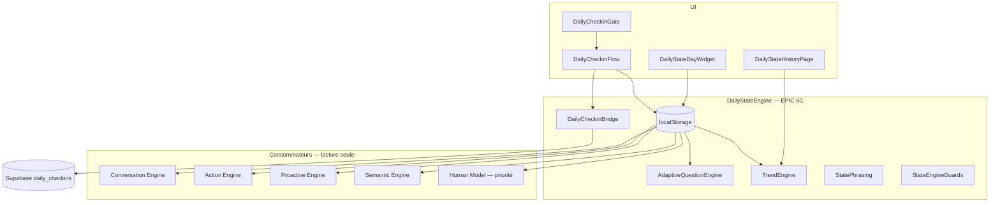
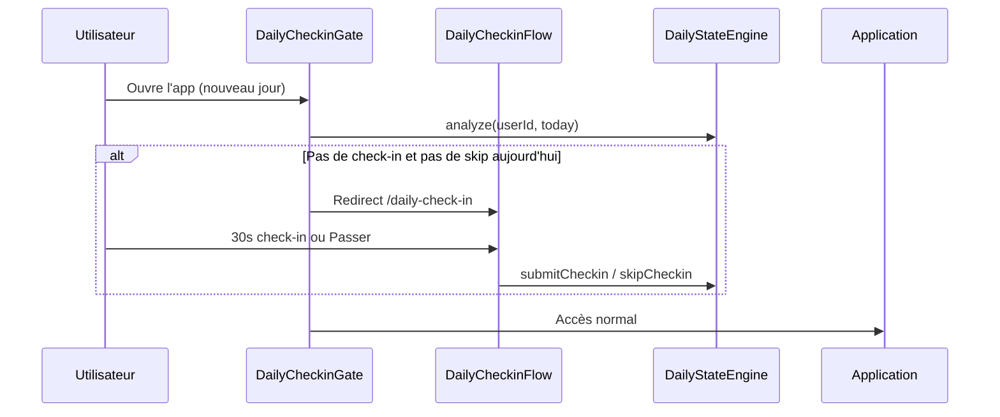

# EPIC 6C — Daily Check-in & State Engine

## Vision

Capturer l'**état réel déclaré** de l'utilisateur en **~30 secondes** au début de la journée.

Ce n'est **pas un questionnaire** : check-in intelligent, facultatif, jamais bloquant après un « Passer ».

Le check-in devient la **source prioritaire** pour tous les moteurs IA.

## Architecture



## Cycle quotidien



## Contrat DailyState

| Champ | Description |
|-------|-------------|
| `date` | Date ISO (YYYY-MM-DD) |
| `mood` | excellent → very_tired |
| `energy` | 1–10 |
| `stress` | 1–10 |
| `sleepQuality` | 1–5 étoiles |
| `specialDay` | normal, busy, family, … |
| `notes` | Optionnel |
| `confidence` | Fiabilité déclarative |
| `source` | checkin / edited / imported |
| `createdAt`, `updatedAt` | Horodatage |

## Priorité des données

1. **DailyState du jour** (check-in explicite) — priorité absolue
2. Legacy `DailyCheckinRecord` (Supabase)
3. Déductions automatiques (planning, tâches, humeur inférée)

Le Human Model (`fatigueRule`, `stressRule`, `sleepRule`) lit `dailyStateToday` **avant** toute heuristique.

## Questions adaptatives

| Condition | Comportement |
|-----------|--------------|
| 7+ jours avec sommeil ≥ 4.8/5 | Question sommeil supprimée |
| Énergie ≤ 3 et sommeil ignoré | **Une** question : « As-tu mal dormi ? » |
| Maximum | 1 question adaptative |

## Modes check-in

| Mode | Questions |
|------|-----------|
| **Rapide** (quick) | Humeur + énergie |
| **Standard** (default) | + stress + sommeil |
| **Complet** (complete) | + journée particulière + note |

Réglage : page `/daily-state/history` → section « Mode check-in ».

## Politique de skip

- Bouton **Passer** — jamais bloquant
- Skip tracé par date (`recordSkip`)
- ≥ 3 jours consécutifs sans check-in → **rappel doux** sur l'accueil (pas de blocage)

## Historique & tendances

Périodes : **7 jours**, **30 jours**, **12 mois**.

Métriques : énergie moyenne, stress moyen, sommeil moyen, fatigue moyenne, évolution (improving / stable / declining).

**Disclaimer** : tendances basées sur le ressenti déclaré — **aucun diagnostic médical**.

## Intégrations moteurs

| Moteur | Usage |
|--------|-------|
| Human Model | Énergie / stress / sommeil déclarés |
| Semantic | Insight « planning chargé + fatigue » |
| Proactive | Réduction suggestions si énergie ≤ 4 |
| Action | Confiance réduite — jamais d'action auto |
| Conversation | Ton adapté (« journée plus légère », « pleine forme ») |

## Flag d'activation

```env
VITE_DAILY_STATE_ENGINE=true
```

Recommandé avec les moteurs IA existants (Human Model, Semantic, Proactive).

## Routes

| Route | Page |
|-------|------|
| `/daily-check-in` | Check-in quotidien (gate) |
| `/daily-state/history` | Historique, tendances, mode |

## Tests

```bash
npm run test:daily-state-engine
```

Couverture : engine, adaptive, trends, guards, phrasing, Human Model priority, proactive, conversation.

## Roadmap future

- Sync bidirectionnelle Supabase ↔ localStorage au démarrage
- Rappel push optionnel (non bloquant)
- Corrélation tendances × planning (visualisation)
- Personnalisation des seuils adaptatifs par profil
- Export anonymisé pour bilan personnel
