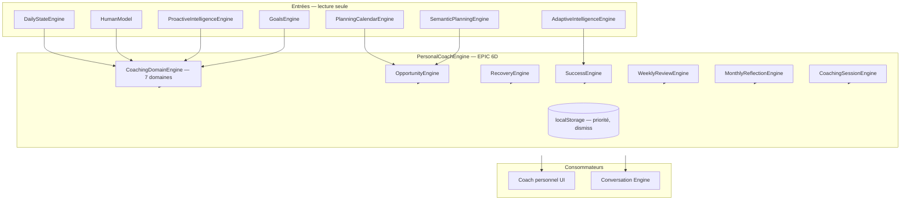
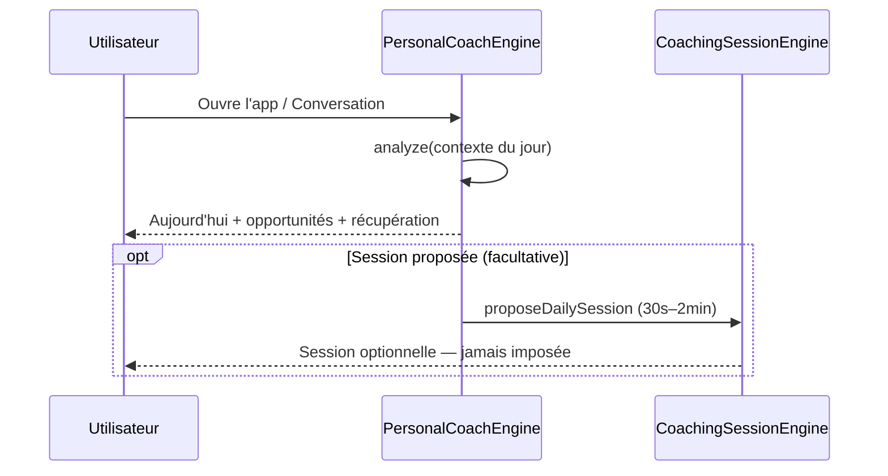

# EPIC 6D — Personal Coach Engine

## Vision

Créer le **moteur de coaching intelligent** d'Équilibre IA.

**Principe fondamental : le Coach accompagne, suggère et encourage — il ne donne jamais d'ordres et ne prend aucune action automatique.**

## Architecture



## Cycle quotidien



## Cycle hebdomadaire / mensuel

| Moment | Moteur | Durée |
|--------|--------|-------|
| Week-end | `WeeklyReviewEngine` | ~1 min |
| Début/fin de mois | `MonthlyReflectionEngine` | ~90 s |

Jamais bloquant — affiché sur la page Coach si fenêtre active.

## Domaines de coaching

| Domaine | Observations | Opportunités | Conseils | Encouragements |
|---------|--------------|--------------|----------|----------------|
| Activité physique | Énergie, créneaux | Bon moment pour bouger | Activité douce si fatigue | Habitudes sport |
| Sommeil / récupération | Tendances fatigue | — | Pause, soirée calme | — |
| Charge mentale | Surcharge | — | Découper, reporter | — |
| Bien-être | Équilibre du jour | Créneaux légers | — | Journée équilibrée |
| Vie familiale | Contexte foyer | Gestes famille | — | — |
| Études | Temps libre | Session courte | — | — |
| Objectifs personnels | Objectifs actifs | Objectif à portée | Petits pas | Progrès |

## Priorité actuelle (Life Priority)

| Valeur | Label |
|--------|-------|
| `balance` | Équilibre (défaut) |
| `family` | Famille |
| `wellbeing` | Bien-être |
| `sport` | Sport |
| `study` | Études |
| `personal_goals` | Objectifs personnels |

Modifiable à tout moment sur `/organization/personal-coach`.

## Explainability

Chaque conseil (`CoachAdvice`) inclut :

- **Pourquoi ?** — `explainability.why`
- **Pourquoi aujourd'hui ?** — `explainability.whyToday`
- **Objectif concerné** — `explainability.goalName` (optionnel)
- **Impact attendu** — `explainability.expectedImpact`
- **Confiance** — `explainability.confidence` (0–1)

## Opportunités & récupération

**OpportunityEngine** — détecte créneaux libres, énergie élevée, objectifs proches, habitudes.  
Formulation : *« C'est un bon moment pour… »* — **sans planification automatique**.

**RecoveryEngine** — détecte fatigue, surcharge, stress, jours difficiles.  
Propose : reporter, alléger, récupérer, simplifier.

## Célébration (SuccessEngine)

- Objectifs, habitudes, progrès récents
- Messages **naturels et non répétitifs** (tracking localStorage)
- Jamais culpabilisant

## Flag d'activation

```env
VITE_PERSONAL_COACH_ENGINE=true
```

Recommandé avec :

```env
VITE_DAILY_STATE_ENGINE=true
VITE_SEMANTIC_PLANNING_ENGINE=true
VITE_ADAPTIVE_INTELLIGENCE=true
```

## Route UI

`/organization/personal-coach` — Organisation → Coach personnel

Sections : Aujourd'hui, Opportunités, Récupération, Réussites, Revue hebdo/mensuelle, Priorité actuelle.

## Tests

```bash
npm run test:personal-coach-engine
```

## Roadmap future

- Intégration `ProactiveCoachBanner` → nouveau moteur
- Sessions push optionnelles (non bloquantes)
- Corrélation coach × outcome observation
- Personnalisation ton par `coachPersonality` (Living Memory)
- Export bilan mensuel PDF anonymisé
