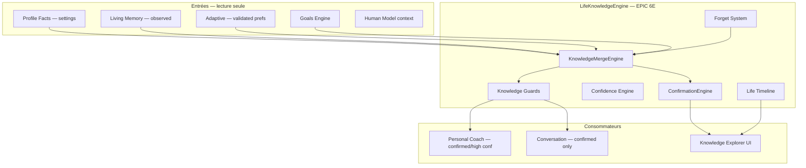
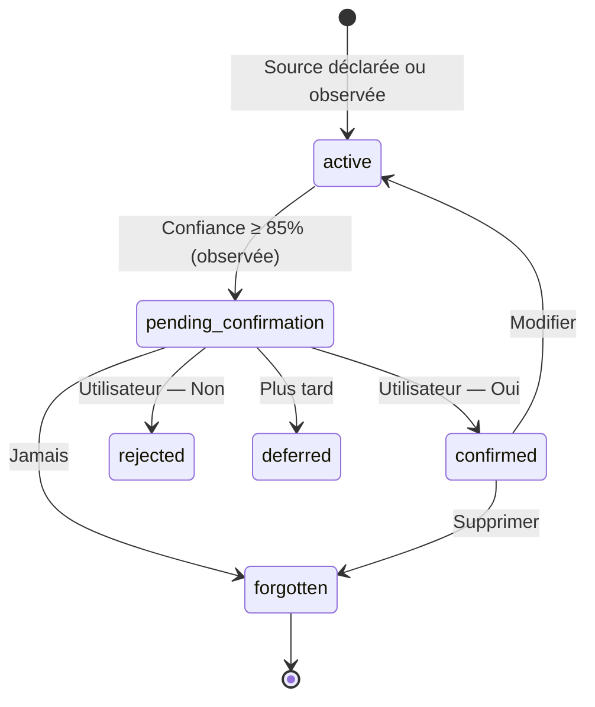

# EPIC 6E — Life Knowledge Engine

## Vision

Centraliser **tout ce que l'IA apprend durablement** sur l'utilisateur — de façon **transparente et contrôlée**.

Aucune donnée cachée. Sources autorisées uniquement :

- Paramètres utilisateur
- Habitudes observées (avec confirmation)
- Réponses volontaires
- Objectifs créés

## Architecture



## Cycle de vie d'une connaissance



**Jamais de validation automatique.**

## Fiche Life Profile — catégories

| Catégorie | Exemples |
|-----------|----------|
| Vie personnelle | Famille, enfants, animaux, rythme |
| Travail | Horaires, télétravail, déplacements |
| Santé / récupération | Coucher, lever, énergie |
| Préférences | Matin/soir, notifications, durée sessions |
| Objectifs long terme | Sport, études, équilibre, projets |
| Changements de vie | Emploi, naissance, déménagement, vacances |

## Niveau de confiance

Chaque `LifeKnowledgeItem` possède :

- `source` — settings | observed | voluntary | goals | user_confirmed
- `confidence` — 0 à 0.99
- `createdAt`, `updatedAt`, `lastVerifiedAt`
- `evidence` — origine explicable

Seuil confirmation : **85 %** (`CONFIRMATION_THRESHOLD`)  
Seuil coach : **85 %** ou statut confirmé  
Haute confiance affichée : **92 %+**

## Confirmation Engine

Message type :

> J'ai remarqué que tu sembles préférer travailler le matin. Souhaites-tu que je retienne cette préférence ?

Options : **Oui** | **Non** | **Plus tard** | **Jamais**

## Forget System

- **Modifier** — override local immédiat
- **Supprimer** — oubli persisté (localStorage)
- **Réinitialiser** — efface overrides et oublis

Le moteur respecte **immédiatement** le choix utilisateur.

## Intégrations

| Moteur | Règle |
|--------|-------|
| Conversation | Préférences **confirmées** uniquement |
| Personal Coach | Confirmées **ou** confiance ≥ 85 % |
| Human Model | Enrichissement via `knownFactsCount` + futur bridge |

## Flag d'activation

```env
VITE_LIFE_KNOWLEDGE_ENGINE=true
```

## Route UI

`/organization/life-knowledge` — **Ce que l'IA sait sur moi**

Sections : Vie personnelle, Travail, Habitudes, Préférences, Objectifs, Changements de vie.

Chaque item : source, confiance, date, modifier, supprimer.

## Tests

```bash
npm run test:life-knowledge-engine
```

## Roadmap future

- Sync bidirectionnelle Supabase profile_facts ↔ knowledge store
- Export / portabilité des connaissances (RGPD)
- Fusion avec `MyAiPage` living insights
- Confirmation inline dans la conversation
- Corrélation knowledge × outcome observation
